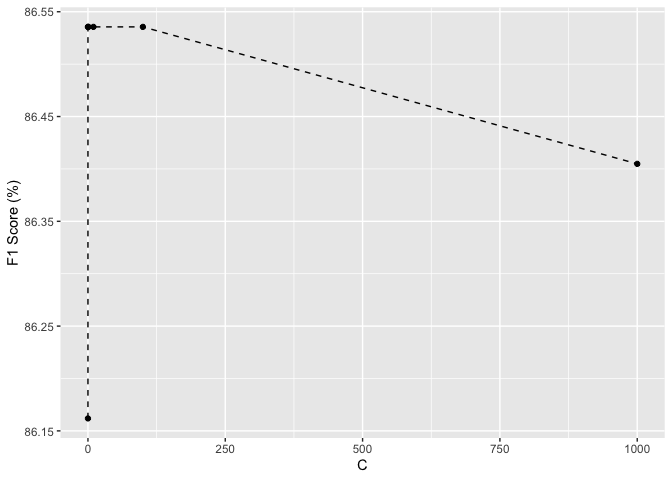
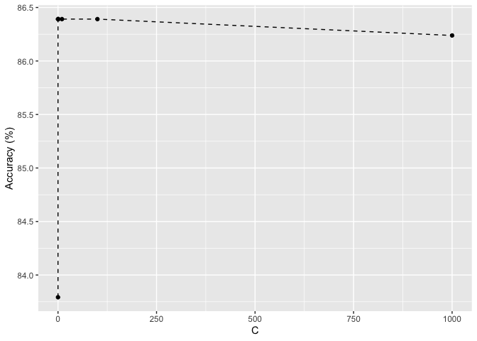

predict_credit_approval
================
Joanna Rashid
2021-11-26

## Credit Card Data

``` r
library(rmarkdown)
```

    ## Warning: package 'rmarkdown' was built under R version 4.1.2

``` r
cc_data <- read.delim("/Users/joannarashid/Documents/Documents - Joanna’s MacBook Pro/School/ISYE6501/credit_card_data.txt", #creating df
                      stringsAsFactors = FALSE, 
                      header=FALSE) 
data <- as.matrix(cc_data) #creating matrix

data[,11] = factor(data[,11])

head(data)
```

    ##      V1    V2    V3   V4 V5 V6 V7 V8  V9 V10 V11
    ## [1,]  1 30.83 0.000 1.25  1  0  1  1 202   0   2
    ## [2,]  0 58.67 4.460 3.04  1  0  6  1  43 560   2
    ## [3,]  0 24.50 0.500 1.50  1  1  0  1 280 824   2
    ## [4,]  1 27.83 1.540 3.75  1  0  5  0 100   3   2
    ## [5,]  1 20.17 5.625 1.71  1  1  0  1 120   0   2
    ## [6,]  1 32.08 4.000 2.50  1  1  0  0 360   0   2

``` r
summary(data)
```

    ##        V1               V2              V3               V4        
    ##  Min.   :0.0000   Min.   :13.75   Min.   : 0.000   Min.   : 0.000  
    ##  1st Qu.:0.0000   1st Qu.:22.58   1st Qu.: 1.040   1st Qu.: 0.165  
    ##  Median :1.0000   Median :28.46   Median : 2.855   Median : 1.000  
    ##  Mean   :0.6896   Mean   :31.58   Mean   : 4.831   Mean   : 2.242  
    ##  3rd Qu.:1.0000   3rd Qu.:38.25   3rd Qu.: 7.438   3rd Qu.: 2.615  
    ##  Max.   :1.0000   Max.   :80.25   Max.   :28.000   Max.   :28.500  
    ##        V5               V6               V7               V8        
    ##  Min.   :0.0000   Min.   :0.0000   Min.   : 0.000   Min.   :0.0000  
    ##  1st Qu.:0.0000   1st Qu.:0.0000   1st Qu.: 0.000   1st Qu.:0.0000  
    ##  Median :1.0000   Median :1.0000   Median : 0.000   Median :1.0000  
    ##  Mean   :0.5352   Mean   :0.5612   Mean   : 2.498   Mean   :0.5382  
    ##  3rd Qu.:1.0000   3rd Qu.:1.0000   3rd Qu.: 3.000   3rd Qu.:1.0000  
    ##  Max.   :1.0000   Max.   :1.0000   Max.   :67.000   Max.   :1.0000  
    ##        V9               V10              V11       
    ##  Min.   :   0.00   Min.   :     0   Min.   :1.000  
    ##  1st Qu.:  70.75   1st Qu.:     0   1st Qu.:1.000  
    ##  Median : 160.00   Median :     5   Median :1.000  
    ##  Mean   : 180.08   Mean   :  1013   Mean   :1.453  
    ##  3rd Qu.: 271.00   3rd Qu.:   399   3rd Qu.:2.000  
    ##  Max.   :2000.00   Max.   :100000   Max.   :2.000

## Creating SVM model and calculating coefficients and intercept:

``` r
library(kernlab)
```

    ## Warning: package 'kernlab' was built under R version 4.1.2

``` r
library(caret)
```

    ## Loading required package: lattice

    ## Loading required package: ggplot2

    ## Warning: package 'ggplot2' was built under R version 4.1.2

    ## 
    ## Attaching package: 'ggplot2'

    ## The following object is masked from 'package:kernlab':
    ## 
    ##     alpha

``` r
set.seed(2) 

C = c(.001, .01, .1, 1, 10, 100, 1000) #Values of C to be tested
model_list = c()
conf_matrix_list = c()
modelling_result = NULL

# call ksvm in a loop to test several value of C.  
# Vanilladot is a simple linear kernel.  
for (i in C){
model <- ksvm(data[,1:10],
              data[,11],
              type='C-svc',
              kernel='vanilladot',
              C=i,
              scaled=TRUE)
pred <- predict(model,data[,1:10])

cat(sprintf('\n---------------------------\n'))
cat(sprintf('C: %.6f\n', i))

conf_matrix = confusionMatrix(factor(pred), factor(data[,11]))
accuracy = conf_matrix[['overall']][['Accuracy']] * 100
f1_score = conf_matrix[['byClass']][['F1']] * 100

print(conf_matrix[["table"]])
cat(sprintf('Accuracy: %.2f %%\tF1 Score: %.2f %%\n', accuracy, f1_score))

model_list = c(model_list, model)
conf_matrix_list = c(conf_matrix_list, conf_matrix)
modelling_result = rbind(modelling_result, data.frame(i, accuracy, f1_score))
print(paste("Percent of model's prediction match actual value for C=", 
            i,
            "is", 
            sum(pred == data[,11]) / nrow(data)))
}
```

    ##  Setting default kernel parameters  
    ## 
    ## ---------------------------
    ## C: 0.001000
    ##           Reference
    ## Prediction   1   2
    ##          1 330  78
    ##          2  28 218
    ## Accuracy: 83.79 %    F1 Score: 86.16 %
    ## [1] "Percent of model's prediction match actual value for C= 0.001 is 0.837920489296636"
    ##  Setting default kernel parameters  
    ## 
    ## ---------------------------
    ## C: 0.010000
    ##           Reference
    ## Prediction   1   2
    ##          1 286  17
    ##          2  72 279
    ## Accuracy: 86.39 %    F1 Score: 86.54 %
    ## [1] "Percent of model's prediction match actual value for C= 0.01 is 0.863914373088685"
    ##  Setting default kernel parameters  
    ## 
    ## ---------------------------
    ## C: 0.100000
    ##           Reference
    ## Prediction   1   2
    ##          1 286  17
    ##          2  72 279
    ## Accuracy: 86.39 %    F1 Score: 86.54 %
    ## [1] "Percent of model's prediction match actual value for C= 0.1 is 0.863914373088685"
    ##  Setting default kernel parameters  
    ## 
    ## ---------------------------
    ## C: 1.000000
    ##           Reference
    ## Prediction   1   2
    ##          1 286  17
    ##          2  72 279
    ## Accuracy: 86.39 %    F1 Score: 86.54 %
    ## [1] "Percent of model's prediction match actual value for C= 1 is 0.863914373088685"
    ##  Setting default kernel parameters  
    ## 
    ## ---------------------------
    ## C: 10.000000
    ##           Reference
    ## Prediction   1   2
    ##          1 286  17
    ##          2  72 279
    ## Accuracy: 86.39 %    F1 Score: 86.54 %
    ## [1] "Percent of model's prediction match actual value for C= 10 is 0.863914373088685"
    ##  Setting default kernel parameters  
    ## 
    ## ---------------------------
    ## C: 100.000000
    ##           Reference
    ## Prediction   1   2
    ##          1 286  17
    ##          2  72 279
    ## Accuracy: 86.39 %    F1 Score: 86.54 %
    ## [1] "Percent of model's prediction match actual value for C= 100 is 0.863914373088685"
    ##  Setting default kernel parameters  
    ## 
    ## ---------------------------
    ## C: 1000.000000
    ##           Reference
    ## Prediction   1   2
    ##          1 286  18
    ##          2  72 278
    ## Accuracy: 86.24 %    F1 Score: 86.40 %
    ## [1] "Percent of model's prediction match actual value for C= 1000 is 0.862385321100917"

``` r
#plot accuracy and F1 score
ggplot(data = modelling_result, aes(x=i, y=f1_score)) +
geom_line(linetype = "dashed") + geom_point() +
labs(x='C', y ='F1 Score (%)')
```

<!-- -->

``` r
ggplot(data=modelling_result, aes(x=i, y=accuracy)) +
geom_line(linetype = "dashed") + geom_point() +
labs(x='C', y='Accuracy (%)')
```

<!-- -->

``` r
#model with C=1
model <- ksvm(data[,1:10],
              data[,11],
              type='C-svc',
              kernel='vanilladot',
              C=1,scaled=TRUE)
```

    ##  Setting default kernel parameters

``` r
# calculate a1…am
a <- colSums(model@xmatrix[[1]] * model@coef[[1]])
a
```

    ##            V1            V2            V3            V4            V5 
    ## -0.0011026642 -0.0008980539 -0.0016074557  0.0029041700  1.0047363456 
    ##            V6            V7            V8            V9           V10 
    ## -0.0029852110 -0.0002035179 -0.0005504803 -0.0012519187  0.1064404601

``` r
# calculate a0
a0 <- -model@b
a0
```

    ## [1] 0.08148382

The kvsm classifier produces the following model:

$(.08148382 -0.0011026642 V1 - 0.0008980539 V2 - 0.0016074557 V3 + 0.0029041700 V4 + 1.0047363456 V5$
$- 0.0029852110 V6 - 0.0002035179 V7 - 0.0005504803 V8 - 0.0012519187 V9 + 0.1064404601 V10 + 0.08148382)1 = 0$

## Conclusion

A ksvm classifier model trained on this data accurately predicts credit
card approval for approximately 86% of applicants when C = 1 and when
C=100. 86% is the highest level of accuracy achieved amoung tested
values of C. Lower values of C classify a wider range of applications
and higher values represent a more narrow margin. So it seems that 1 is
a better choice than 100 since the margin for classifying points will be
wider with the same classification accuracy.
