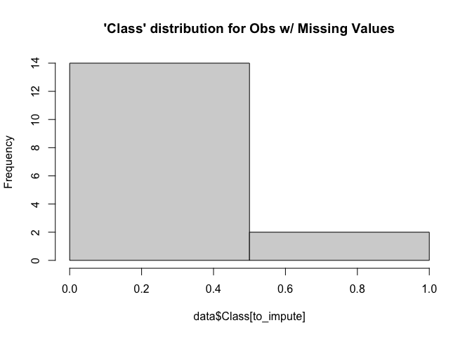
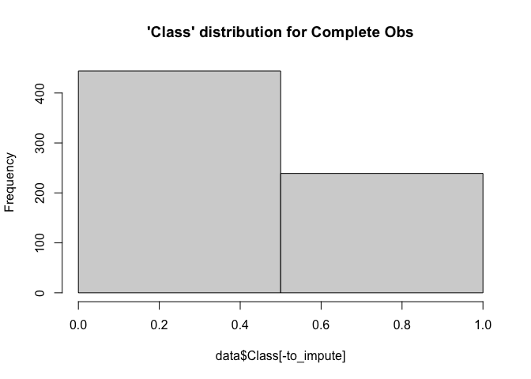

Imputation Methods
================
Joanna Rashid
2021-11-26

## Data

The breast cancer data set breast-cancer-wisconsin.data.txt from
<http://archive.ics.uci.edu/ml/machine-learning-databases/breast-cancer-wisconsin/>
(description at
<http://archive.ics.uci.edu/ml/datasets/Breast+Cancer+Wisconsin+%28Original%29>
) has missing values.

``` r
data <- read.csv("/Users/joannarashid/Documents/Documents - Joanna’s MacBook Pro/School/ISYE6501/breast-cancer-wisconsin.data", header=FALSE)
```

Attribute Information:

1.  Sample code number: id number
2.  Clump Thickness: 1 - 10
3.  Uniformity of Cell Size: 1 - 10
4.  Uniformity of Cell Shape: 1 - 10
5.  Marginal Adhesion: 1 - 10
6.  Single Epithelial Cell Size: 1 - 10
7.  Bare Nuclei: 1 - 10
8.  Bland Chromatin: 1 - 10
9.  Normal Nucleoli: 1 - 10
10. Mitoses: 1 - 10
11. Class: (2 for benign, 4 for malignant)

Adding column names to data set for clarity:

``` r
colnames(data) <- c("ID", 
                    "Clump_Thickness", 
                    "Size", 
                    "Shape",
                    "Marginal Adhesion",
                    "Single_Epith_Cell_Size", 
                    "Bare_Nuclei",
                    "Bland_Chromatin",
                    "Normal_Nucleoli", 
                    "Mitoses", 
                    "Class")

data$Class[data$Class == 2] <- 0 #Benign
data$Class[data$Class == 4] <- 1 #Malignant
```

``` r
summary(data)
```

    ##        ID           Clump_Thickness       Size            Shape       
    ##  Min.   :   61634   Min.   : 1.000   Min.   : 1.000   Min.   : 1.000  
    ##  1st Qu.:  870688   1st Qu.: 2.000   1st Qu.: 1.000   1st Qu.: 1.000  
    ##  Median : 1171710   Median : 4.000   Median : 1.000   Median : 1.000  
    ##  Mean   : 1071704   Mean   : 4.418   Mean   : 3.134   Mean   : 3.207  
    ##  3rd Qu.: 1238298   3rd Qu.: 6.000   3rd Qu.: 5.000   3rd Qu.: 5.000  
    ##  Max.   :13454352   Max.   :10.000   Max.   :10.000   Max.   :10.000  
    ##  Marginal Adhesion Single_Epith_Cell_Size Bare_Nuclei        Bland_Chromatin 
    ##  Min.   : 1.000    Min.   : 1.000         Length:699         Min.   : 1.000  
    ##  1st Qu.: 1.000    1st Qu.: 2.000         Class :character   1st Qu.: 2.000  
    ##  Median : 1.000    Median : 2.000         Mode  :character   Median : 3.000  
    ##  Mean   : 2.807    Mean   : 3.216                            Mean   : 3.438  
    ##  3rd Qu.: 4.000    3rd Qu.: 4.000                            3rd Qu.: 5.000  
    ##  Max.   :10.000    Max.   :10.000                            Max.   :10.000  
    ##  Normal_Nucleoli     Mitoses           Class       
    ##  Min.   : 1.000   Min.   : 1.000   Min.   :0.0000  
    ##  1st Qu.: 1.000   1st Qu.: 1.000   1st Qu.:0.0000  
    ##  Median : 1.000   Median : 1.000   Median :0.0000  
    ##  Mean   : 2.867   Mean   : 1.589   Mean   :0.3448  
    ##  3rd Qu.: 4.000   3rd Qu.: 1.000   3rd Qu.:1.0000  
    ##  Max.   :10.000   Max.   :10.000   Max.   :1.0000

‘Bare Nuclei’ contains values as character because some values are ‘?’

``` r
library(dplyr)
```

    ## Warning: package 'dplyr' was built under R version 4.1.2

    ## 
    ## Attaching package: 'dplyr'

    ## The following objects are masked from 'package:stats':
    ## 
    ##     filter, lag

    ## The following objects are masked from 'package:base':
    ## 
    ##     intersect, setdiff, setequal, union

``` r
data %>% count(data$Bare_Nuclei =="?")
```

    ##   data$Bare_Nuclei == "?"   n
    ## 1                   FALSE 683
    ## 2                    TRUE  16

``` r
#16 missing values found out of 699 total observations

to_impute <- which(data$Bare_Nuclei=="?")

length(to_impute)/nrow(data)
```

    ## [1] 0.02288984

``` r
#only approximately 2% missing values
```

``` r
hist(data$Class[to_impute], breaks = 2, main = "'Class' distribution for Obs w/ Missing Values")
```

<!-- -->

``` r
hist(data$Class[-to_impute], breaks = 2, main = "'Class' distribution for Complete Obs")
```

<!-- -->
The 16 observations with missing values for ‘Bar Nuclei’ appear to have
a distribution of the ‘Class’ variable that is different from the rest
of the data set suggesting it is possible we are introducing bias by
imputing values for these observations, but likely within tolerable
limits since the difference between the two groups of data points is not
huge.

``` r
data_missing  <- data[to_impute,]
data_not_missing <- data[-to_impute,]

data_not_missing$Bare_Nuclei <- as.numeric(data_not_missing$Bare_Nuclei)
```

1.  Use the mean/mode imputation method to impute values for the missing
    data.

``` r
#calculating mean
Bare_nuclei_mean <- mean(data_not_missing$Bare_Nuclei[-to_impute])

Bare_nuclei_mean
```

    ## [1] 3.52024

``` r
#new df with imputed values (mean)
data_mean <- data
data_mean$Bare_Nuclei[to_impute] <- Bare_nuclei_mean

data_mean$Bare_Nuclei <- as.numeric(data_mean$Bare_Nuclei)
```

2.  Use regression to impute values for the missing data.

``` r
#linear model with Bare_Nuclei as the response variable 
#omitting Class so as not to introduce bias and for usability
#omitting ID since it is irrelevant
model <- lm(Bare_Nuclei~.-ID -Class, 
            data = data_not_missing)
summary(model)
```

    ## 
    ## Call:
    ## lm(formula = Bare_Nuclei ~ . - ID - Class, data = data_not_missing)
    ## 
    ## Residuals:
    ##     Min      1Q  Median      3Q     Max 
    ## -9.7316 -0.9426 -0.3002  0.6725  8.6998 
    ## 
    ## Coefficients:
    ##                         Estimate Std. Error t value Pr(>|t|)    
    ## (Intercept)            -0.616652   0.194975  -3.163  0.00163 ** 
    ## Clump_Thickness         0.230156   0.041691   5.521 4.83e-08 ***
    ## Size                   -0.067980   0.076170  -0.892  0.37246    
    ## Shape                   0.340442   0.073420   4.637 4.25e-06 ***
    ## `Marginal Adhesion`     0.339705   0.045919   7.398 4.13e-13 ***
    ## Single_Epith_Cell_Size  0.090392   0.062541   1.445  0.14883    
    ## Bland_Chromatin         0.320577   0.059047   5.429 7.91e-08 ***
    ## Normal_Nucleoli         0.007293   0.044486   0.164  0.86983    
    ## Mitoses                -0.075230   0.059331  -1.268  0.20524    
    ## ---
    ## Signif. codes:  0 '***' 0.001 '**' 0.01 '*' 0.05 '.' 0.1 ' ' 1
    ## 
    ## Residual standard error: 2.274 on 674 degrees of freedom
    ## Multiple R-squared:  0.615,  Adjusted R-squared:  0.6104 
    ## F-statistic: 134.6 on 8 and 674 DF,  p-value: < 2.2e-16

``` r
#predict regression imputed values
reg_val <- predict(model, data_missing)
reg_val
```

    ##        24        41       140       146       159       165       236       250 
    ## 5.3660666 8.2259101 0.8892805 1.6605574 1.0899300 2.2208736 2.7818889 1.7605617 
    ##       276       293       295       298       316       322       412       618 
    ## 2.1208694 5.8459477 0.9796727 2.3918282 5.5419942 1.7605617 0.8892805 0.5687034

``` r
#new df with regression imputed values
data_reg <- data
data_reg$Bare_Nuclei[to_impute] <- reg_val

data_reg$Bare_Nuclei <- as.numeric(data_reg$Bare_Nuclei)
```

3.  Use regression with perturbation to impute values for the missing
    data.

``` r
#determining mean and std of clean observations to use for perturbation
m <- mean(data_not_missing$Bare_Nuclei)
s <- sd(data_not_missing$Bare_Nuclei)

set.seed(2)
perturb <- rnorm(length(to_impute), m, s)

#creating values with perturbation
pert_val <- round(reg_val + perturb)

pert_val
```

    ##  24  41 140 146 159 165 236 250 276 293 295 298 316 322 412 618 
    ##   6  12  10   1   4   6   9   4  13   9   6  10   8   2  11  -4

Above are the values imputed by regressing all relevant variables on
Bare_nuclei. Some are outside of the range 1-10 and will need to be
rounded.

``` r
#adding values to new df
data_pert <- data
  
data_pert$Bare_Nuclei[to_impute] <- pert_val

data_pert$Bare_Nuclei <- as.numeric(data_pert$Bare_Nuclei)
```

``` r
#round up or down to keep values in range of 1 to 10
for(i in 1:nrow(data_pert))
  {
  if (data_pert$Bare_Nuclei[i] > 10){data_pert$Bare_Nuclei[i] <- 10}
  if (data_pert$Bare_Nuclei[i] < 1){data_pert$Bare_Nuclei[i] <- 1}
}
```

4.  (Optional) Compare the results and quality of classification models
    (e.g., SVM, KNN) build using

<!-- -->

1)  the data sets from questions 1,2,3;

``` r
library(caret)
```

    ## Loading required package: lattice

    ## Loading required package: ggplot2

    ## Warning: package 'ggplot2' was built under R version 4.1.2

``` r
#Test and train split:
set.seed(2)
trainIndex <- createDataPartition(data_mean$Class, p = .8, 
                                  list = FALSE, 
                                  times = 1)
train_mean <- data_mean[ trainIndex,]
test_mean  <- data_mean[-trainIndex,]
```

\###1. KNN model with MEAN IMPUTATION for missing values

``` r
library(kknn)
```

    ## 
    ## Attaching package: 'kknn'

    ## The following object is masked from 'package:caret':
    ## 
    ##     contr.dummy

``` r
set.seed(2)

fit_mean <- kknn(Class~.-ID,
                  train = train_mean,
                  test = test_mean,
                  k = 5,
                  distance = 2,
                  kernel = "optimal",
                  scale = TRUE)

mean_predicted <- as.integer(fitted.values(fit_mean)+.5)

mean_accuracy <- sum(mean_predicted == test_mean[,11]) / nrow(test_mean)

print(mean_accuracy)
```

    ## [1] 0.9568345

``` r
conf_matrix <- as.matrix(table(mean_predicted, test_mean$Class))
conf_matrix
```

    ##               
    ## mean_predicted  0  1
    ##              0 84  3
    ##              1  3 49

\###2. KNN model with REGRESSION IMPUTATION for missing values

``` r
#Test and train split:
set.seed(2)
trainIndex <- createDataPartition(data_reg$Class, p = .8, 
                                  list = FALSE, 
                                  times = 1)
train_reg <- data_reg[ trainIndex,]
test_reg  <- data_reg[-trainIndex,]
```

``` r
fit_reg <- kknn(Class~.-ID,
                  train = train_reg,
                  test = test_reg,
                  k = 5,
                  distance = 2,
                  kernel = "optimal",
                  scale = TRUE)

reg_predicted <- as.integer(fitted.values(fit_reg)+.5)

reg_accuracy <- sum(reg_predicted == test_reg[,11]) / nrow(test_reg)

print(reg_accuracy)
```

    ## [1] 0.9568345

``` r
conf_matrix <- as.matrix(table(reg_predicted, test_reg$Class))
conf_matrix
```

    ##              
    ## reg_predicted  0  1
    ##             0 84  3
    ##             1  3 49

\###3. KNN model with REGRESSION IMPUTATION WITH PERTURBATION for
missing values

``` r
#Test and train split:
set.seed(2)
trainIndex <- createDataPartition(data_pert$Class, p = .8, 
                                  list = FALSE, 
                                  times = 1)
train_pert <- data_pert[ trainIndex,]
test_pert <- data_pert[-trainIndex,]
```

``` r
fit_pert <- kknn(Class~.-ID,
                  train = train_pert,
                  test = test_pert,
                  k = 5,
                  distance = 2,
                  kernel = "optimal",
                  scale = TRUE)

pert_predicted <- as.integer(fitted.values(fit_pert)+.5)

pert_accuracy <- sum(pert_predicted == test_pert[,11]) / nrow(test_pert)

print(pert_accuracy)
```

    ## [1] 0.9496403

``` r
conf_matrix <- as.matrix(table(pert_predicted, test_pert$Class))
conf_matrix
```

    ##               
    ## pert_predicted  0  1
    ##              0 83  3
    ##              1  4 49

2)  the data that remains after data points with missing values are
    removed; and

``` r
#Test and train split:
set.seed(2)
trainIndex <- createDataPartition(data_not_missing$Class, p = .8, 
                                  list = FALSE, 
                                  times = 1)
train_nm <- data_not_missing[ trainIndex,]
test_nm <- data_not_missing[-trainIndex,]
```

``` r
fit_nm <- kknn(Class~.-ID,
                  train = train_nm,
                  test = test_nm,
                  k = 5,
                  distance = 2,
                  kernel = "optimal",
                  scale = TRUE)

nm_predicted <- as.integer(fitted.values(fit_nm)+.5)

nm_accuracy <- sum(nm_predicted == test_nm[,11]) / nrow(test_nm)

print(nm_accuracy)
```

    ## [1] 0.9485294

``` r
conf_matrix <- as.matrix(table(nm_predicted, test_nm$Class))
conf_matrix
```

    ##             
    ## nm_predicted  0  1
    ##            0 81  4
    ##            1  3 48

3)  the data set when a binary variable is introduced to indicate
    missing values.

``` r
#new df with binary variable
data_binary <- data

data_binary$no_bare_nuclei <- 0

data_binary$no_bare_nuclei[to_impute] <- 1 #creates new variable =1 if missing value

data_binary$Bare_Nuclei <- as.numeric(data_binary$Bare_Nuclei)
```

    ## Warning: NAs introduced by coercion

``` r
#Test and train split:
set.seed(2)
trainIndex <- createDataPartition(data_binary$Class, p = .8, 
                                  list = FALSE, 
                                  times = 1)
train_bin <- data_binary[ trainIndex,]
test_bin <- data_binary[-trainIndex,]
```

``` r
fit_bin <- kknn(Class~.-ID,
                  train = train_bin,
                  test = test_bin,
                  k = 5,
                  distance = 2,
                  kernel = "optimal",
                  scale = TRUE)

bin_predicted <- as.integer(fitted.values(fit_bin)+.5)

bin_accuracy <- sum(bin_predicted == test_bin[,11]) / nrow(test_bin)
```

    ## Warning in bin_predicted == test_bin[, 11]: longer object length is not a
    ## multiple of shorter object length

``` r
print(bin_accuracy)
```

    ## [1] 0.647482

## Conclusion

``` r
acc_table <- data.frame(Imputation_Method = c("Mean", 
                                "Regression", 
                                "Regression with Perturbation", 
                                "Omit Missing Values",
                                "Binary Variable for Obs w/ Missing Values"),
                      KNN_Model_Accuracy = c(mean_accuracy,
                                             reg_accuracy, 
                                             pert_accuracy,
                                             nm_accuracy,
                                             bin_accuracy))
acc_table
```

    ##                           Imputation_Method KNN_Model_Accuracy
    ## 1                                      Mean          0.9568345
    ## 2                                Regression          0.9568345
    ## 3              Regression with Perturbation          0.9496403
    ## 4                       Omit Missing Values          0.9485294
    ## 5 Binary Variable for Obs w/ Missing Values          0.6474820

Imputation of missing values for ‘Bare Nuclei’ by mean and by regression
provide extremely high accuracy, when used to train and test a knn
model. ‘Class’ was removed from the regression used to predict missing
values in order to avoid over fitting. However, this method produced
such stunningly high accuracy, over fitting is likely. More data
exploration is needed. Regression with perturbation perhaps corrects for
some over fitting but still produces a model with very high accuracy,
identifying ‘Class’ accurately 94.8% of the time. Simply omitting
missing variables produces a similarly accurate model. Inclusion of a
binary variable for missing values performed worst with just 64.7%
accuracy.
